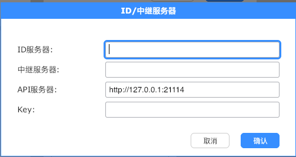

# rustdesk-api-server
RustDesk Api 服务器端 Go语言版本

登录后可返回同账号下所有在用主机 以本号归属开头

## 使用方法

### 导入mysql数据库表
导入数据库 > db.sql

### 修改数据库连接
修改 conf/config.yml 中的配置项
```yaml
mysql:
  host: '127.0.0.1'
  port: 3306 
  database: 'rustdesk' # 数据库名
  username: 'root' # 数据库用户名
  password: '' # 数据库密码
app:
  authkey: 123456 # 授权密码 添加账号或者修改密码使用
  cryptkey: 123123123123  # 密码加密盐值 建议首次修改后面别改 = =
```

### 搭建跑起来

1. 运行程序

2. 端口映射(推荐):
> 直接将21114端口号映射出来 貌似rustdesk默认端口是21114 至少手机端我是~~


nginx服务器:
> 进行反向代理 反向代理可使用80端口什么的
```nginx

#PROXY-START/

location ^~ /
{
    proxy_pass http://127.0.0.1:21114;
    proxy_set_header Host $host;
    proxy_set_header X-Real-IP $remote_addr;
    proxy_set_header X-Forwarded-For $proxy_add_x_forwarded_for;
    proxy_set_header REMOTE-HOST $remote_addr;
    proxy_set_header Upgrade $http_upgrade;
    proxy_set_header Connection $connection_upgrade;
    proxy_http_version 1.1;
    # proxy_hide_header Upgrade;

    add_header X-Cache $upstream_cache_status;

    #Set Nginx Cache
    
    
    set $static_file10BAHqk7 0;
    if ( $uri ~* "\.(gif|png|jpg|css|js|woff|woff2)$" )
    {
    	set $static_file10BAHqk7 1;
    	expires 1m;
        }
    if ( $static_file10BAHqk7 = 0 )
    {
    add_header Cache-Control no-cache;
    }
}

#PROXY-END/
```

### RustDesk配置
ID服务器和中继服务器可自行寻找Docker进行安装

此处只说明API服务器配置


安卓端不需要填写 `http://` 前缀 且必须为 `21114` 端口


### 创建账号
请求
http://127.0.0.1:21114/api/reg?username=test&password=test&auth_key=123456

### 修改密码
请求
http://127.0.0.1:21114/api/set-pwd?username=test&password=test&auth_key=123456


## 注意
保存地址簿时 `username` 等于 `----` 时不会进行保存


## 关于
本项目为学习使用,制作用于 rustdesk 远程协助软件的API服务器交互

使用框架:
[beego](https://github.com/beego/beego)

由于RustDesk接口固定返回内容= =所以接口返回结构不是很统一

## 赞助
